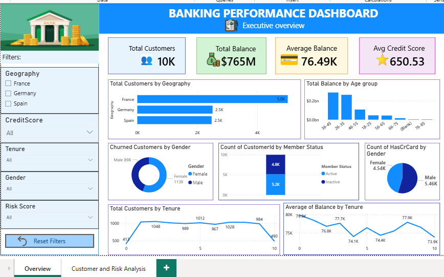
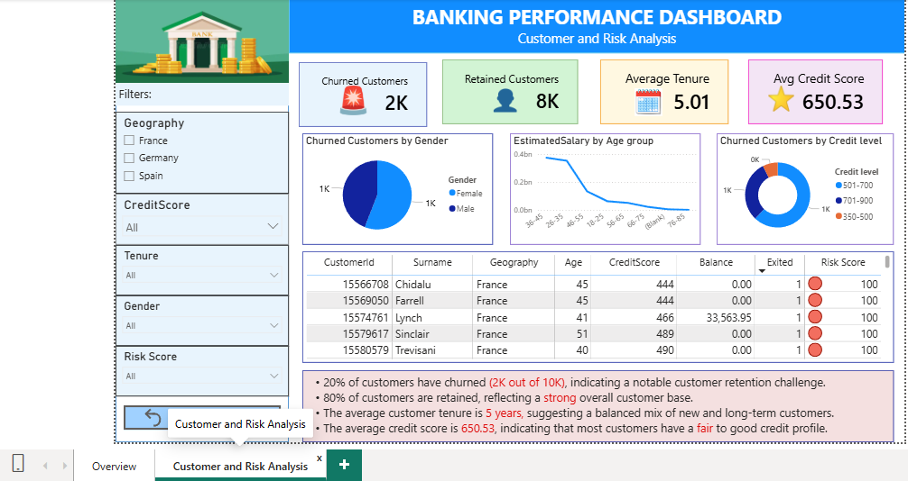

# 🏦 Bank Customer Churn Analytics Dashboard

### End-to-End Business Intelligence Project using Power BI • SQL • Excel

An interactive Business Intelligence dashboard developed to analyze customer churn, identify risk factors, evaluate customer demographics, and support data-driven customer retention strategies.

---

## 🛠️ Technologies Used

---

# 📌 Project Overview

This project analyzes customer churn within a banking institution to identify factors influencing customer retention. The interactive dashboard enables business users to monitor customer demographics, financial metrics, risk profiles, and churn trends for informed decision-making.

---

# 🎯 Business Objectives

- Analyze customer churn patterns
- Identify high-risk customers
- Evaluate customer demographics
- Monitor customer retention metrics
- Improve customer retention strategies

---

# 📊 Key Performance Indicators

- 👥 Total Customers
- 📉 Churn Rate
- 💰 Total Balance
- 💳 Average Balance
- ⭐ Average Credit Score
- 👤 Customer Demographics
- ⚠️ Risk Score Analysis

---

# 📷 Dashboard Preview

| Executive Overview | Customer & Risk Analysis |
|--------------------|--------------------------|
|  |  |

# 💼 Skills Demonstrated

- SQL Queries
- Data Cleaning
- Power BI Dashboard Development
- Data Modeling
- Customer Analytics
- KPI Reporting
- Business Intelligence
- Data Visualization

---

# 📈 Key Insights

- Approximately **20% of customers have churned**, highlighting opportunities for customer retention initiatives.
- Customers with **lower credit scores** exhibit a higher likelihood of churn.
- Customer demographics reveal variations in churn across different age groups and regions.
- Risk scoring enables quick identification of customers requiring proactive engagement.

---

# 💡 Business Recommendations

- Develop targeted retention campaigns for high-risk customers.
- Provide personalized financial products for loyal customers.
- Strengthen engagement with customers showing declining activity.
- Continuously monitor customer churn KPIs to improve retention.

---

# 📂 Repository Contents

- 📊 Power BI Dashboard (.pbix)
- 📷 Dashboard Screenshots
- 📄 Project Documentation
- 📁 Dataset
- 🗄️ SQL Scripts (if applicable)

---

# 👩‍💻 Jayasree M

### Aspiring Data Analyst

**SQL • Power BI • Excel • Data Visualization**

